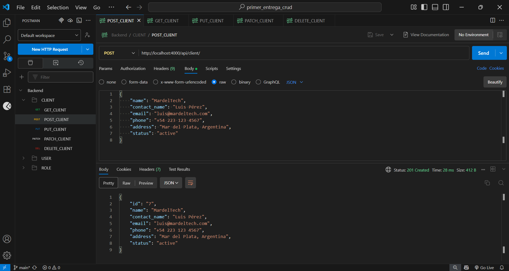
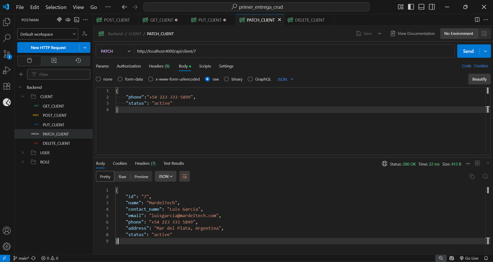

# Tecnicatura Superior en Desarrollo de Software
## **1° Entrega de Proyecto Parcial<br>API RESTful CRUD <br>Caso 2: ClickWave**

**Materia:** Web Systems Development (Back End)  
**Profesor:** Emir Eliezer Garcia Ontiveros  
**Comisión:** A  

**Grupo 2:**  
- Mendiola, Eduardo E.  
- Integrante 2  
- Integrante 3  
- Integrante 4  
- Integrante 5  

**Fecha:** 17-09-2025  

---

## Índice

1. [Introducción del Caso](#introducción-del-caso)  
   1.1 [Propósito del Sistema](#11-propósito-del-sistema)  
   1.2 [Contexto Empresarial](#12-contexto-empresarial)  
       - 2.1 [Descripción General de ClickWave](#121-descripción-general-de-clickwave)  
       - 2.2 [Problemáticas Detectadas](#122-problemáticas-detectadas)  
   1.3 [Objetivos del Sistema](#13-objetivos-del-sistema)  
   1.4 [Arquitectura Técnica del Sistema](#14-arquitectura-técnica-del-sistema)  
2. [Asignación de Roles y Responsabilidades](#2-asignación-de-roles-y-responsabilidades)  
   - Eduardo E. Mendiola  
     - Rol Asignado: Arquitectura de Software y Desarrollo  
3. [Funcionamiento del Sistema](#3-funcionamiento-del-sistema)  
   3.1 [Funcionamiento General](#31-funcionamiento-general)  
   3.2 [Funcionalidades y Módulos Principales](#32-funcionalidades-y-módulos-principales)  
   3.3 [Interacción entre Módulos](#33-interacción-entre-módulos)  
4. [Capturas de Consultas](#4-capturas-de-consultas)  
   4.1 [Ejecución del Servidor](#41-ejecución-del-servidor)  
   4.2 [Ejemplo de Consulta - CRUD: Cliente](#42-ejemplo-de-consulta---crud-cliente)
5. [Uso de IAs](#5-uso-de-ias)  
   5.1 [Modelos](#51-modelos)  
   5.2 [Prompts](#52-prompts)  
6. [Bibliografía y Fuentes](#6-bibliografía-y-fuentes)

---

## Introducción del Caso

### 1.1 Propósito del Sistema
El presente documento describe el Sistema de Gestión de Proyectos desarrollado para ClickWave, una consultora de marketing digital, con el objetivo de optimizar la gestión interna de proyectos y mejorar la eficiencia operativa. La propuesta tecnológica busca transformar procesos informales en flujos de trabajo estandarizados, medibles y trazables, facilitando la centralización de información y la toma de decisiones basada en datos confiables.

### 1.2 Contexto Empresarial

#### 1.2.1 Descripción General de ClickWave
ClickWave fue fundada en 2020 con el propósito de brindar servicios de marketing digital a pequeñas y medianas empresas (PyMEs). Comenzó como un proyecto remoto de un equipo reducido y actualmente cuenta con 12 empleados organizados en distintas áreas: gestión de campañas publicitarias, diseño gráfico, análisis de datos y desarrollo de contenidos digitales.  
Su modalidad de trabajo es híbrida, combinando presencia en oficina y trabajo remoto, lo que permite atender clientes locales e internacionales, aunque mantiene desafíos internos asociados a la informalidad de procesos y la ausencia de roles claramente definidos.

#### 1.2.2 Problemáticas Detectadas
- **Falta de control formal de tiempos:** dificulta la justificación de costos y el cálculo de rentabilidad de los proyectos.  
- **Roles y responsabilidades poco definidos:** provoca desorganización, sobrecarga de trabajo y seguimiento ineficiente.  
- **Limitaciones en evaluación de desempeño y análisis financiero:** impide una evaluación objetiva del rendimiento y retrasa informes financieros precisos.

### 1.3 Objetivos del Sistema
- Formalizar la gestión de proyectos y tareas, centralizando la información y garantizando trazabilidad.  
- Registrar y controlar el tiempo dedicado a cada proyecto para analizar rentabilidad y justificar costos.  
- Generar reportes detallados y paneles de control gerenciales.  
- Integrar la gestión de proyectos con contabilidad y facturación, optimizando procesos financieros.

### 1.4 Arquitectura Técnica del Sistema
El sistema fue desarrollado con un stack **JavaScript**: Node.js como entorno de ejecución y Express.js como framework web. La arquitectura sigue el patrón **MVC** (Modelo-Vista-Controlador), permitiendo:
- Separación clara de responsabilidades entre presentación, lógica de negocio y acceso a datos.  
- Facilitar mantenibilidad, escalabilidad y comprensión del código.  
- Garantizar un flujo de información seguro y centralizado entre usuarios, proyectos y tareas.

---

## 2. Asignación de Roles y Responsabilidades

**Eduardo E. Mendiola**  
**Rol:** Arquitectura de Software y Desarrollo  

**Responsabilidades principales:**
- Diseño y definición de la arquitectura del sistema (controladores, modelos, entidades y rutas).  
- Desarrollo del Core del Framework (BaseController y BaseModel).  
- Gestión de persistencia de datos mediante una base de datos JSON (`JsonDatabase.js`).  
- Implementación de entidades y modelos específicos del dominio (clientes, roles, usuarios).  
- Configuración de rutas y middlewares de la API.  
- Creación y configuración del servidor principal (`server.js`) y variables de entorno (.env).  
- Creación del repositorio en GitHub y generación de documentación principal.  

---

## 3. Funcionamiento del Sistema

El sistema funciona como una **API RESTful** construida sobre Express.js, diseñada para gestionar proyectos, clientes y tiempo. Su punto de entrada es `server.js`, que se encarga de:

1. Cargar variables de entorno desde `.env`.  
2. Inicializar la base de datos JSON (`db.initialize()`).  
3. Importar y ejecutar la aplicación Express (`app.js`) en el puerto configurado.

### 3.1 Funcionamiento General
El sistema opera como un servidor web que procesa peticiones HTTP a través de capas (rutas, middlewares, controladores, modelos) e interactúa con una base de datos JSON. Las respuestas se envían en formato JSON.

### 3.2 Funcionalidades y Módulos Principales
- **Servidor Principal (`server.js`)**: arranque de la aplicación y carga de configuración.  
- **Variables de Entorno y dotenv**: gestión centralizada de configuración sensible.  
- **Servidor Express (`app.js`)**: configuración de middlewares y rutas principales.  
- **Base de Datos JSON (`JsonDatabase.js`, `db.js`)**: persistencia de datos en `db.json`.  
- **Generador de IDs (`IdGenerator.js`)**: creación de IDs únicos secuenciales.  
- **Entidades (`Entity.js`)**: definición de estructura y métodos de objetos de negocio.  
- **Modelos (`BaseModel.js`, modelos específicos)**: operaciones CRUD y lógica específica de cada entidad.  
- **Controladores (`BaseController.js`, controladores específicos)**: manejo de peticiones HTTP y respuestas.  
- **Rutas (`Routes.js`)**: definición de endpoints de la API y asociación con controladores.  
- **Middlewares (`validationMiddleware.js`)**: validación de datos de entrada antes de ejecutar controladores.

### 3.3 Interacción entre Módulos
1. `server.js` arranca el servidor y asegura que la base de datos y variables de entorno estén listas.  
2. Una petición HTTP llega al servidor Express.  
3. `app.js` dirige la petición a la ruta correspondiente.  
4. Middleware de validación verifica los datos de la petición.  
5. El controlador ejecuta la operación correspondiente en el modelo asociado.  
6. El modelo interactúa con la base de datos JSON y genera el resultado.  
7. El controlador construye la respuesta HTTP en formato JSON.

---
¡Hola\! Claro, con gusto te ayudo a convertir ese texto a formato Markdown para tu archivo `README.md`. Es genial que estés documentando tu API, es una práctica excelente para cualquier programador.

-----

### 4\. Capturas de Consultas

Se incluyen capturas de pantalla de las peticiones realizadas con la herramienta Postman en Visual Studio Code, a la API RESTful para demostrar su funcionamiento y validar las operaciones CRUD.

Postman permite enviar solicitudes HTTP (`GET`, `POST`, `PUT`, `PATCH`, `DELETE`) y visualizar respuestas en formato JSON. En este caso, se documenta la gestión de clientes.

-----

### 4.1 Ejecución del Servidor

Antes de realizar cualquier consulta, se ejecuta el servidor de la API para que esté disponible para recibir solicitudes.

Comando ejecutado:

```bash
npm run dev
```

Resultado esperado:

```
Mensaje en consola indicando que el servidor está corriendo, por ejemplo:
Servidor de ClickWave corriendo en http://localhost:4000
```


-----

### 4.2 Ejemplo de Consulta - CRUD: Cliente

#### 1\. Crear un cliente (`POST /api/clients`)

Solicitud enviada:

  - **URL**: `http://localhost:4000/api/clients`
  - **Método**: `POST`
  - **Cuerpo (JSON)**:

<!-- end list -->

```json
{
   "name": "MardelTech",
   "contact_name": "Luis Pérez",
   "email": "luis@mardeltech.com",
   "phone": "+54 223 123 4567",
   "address": "Mar del Plata, Argentina",
   "status": "active"
}
```

Respuesta recibida:

  - **Código HTTP**: `201`
  - **Cuerpo JSON**:

<!-- end list -->

```json
{
   "id": "7",
   "name": "MardelTech",
   "contact_name": "Luis Pérez",
   "email": "luis@mardeltech.com",
   "phone": "+54 223 123 4567",
   "address": "Mar del Plata, Argentina",
   "status": "active"
}
```



-----

#### 2\. Obtener todos los clientes (`GET /api/clients`)

Solicitud enviada:

  - **URL**: `http://localhost:4000/api/clients`
  - **Método**: `GET`
  - **Cuerpo de la solicitud**: No aplica (`GET` no envía cuerpo)

Respuesta recibida:

  - **Código HTTP**: `200`
  - **Cuerpo JSON**:

<!-- end list -->

```json
[
   {
      "id": "1",
      "name": "TechCorp",
      "contact_name": "Laura Pérez",
      "email": "laura@techcorp.com",
      "phone": "+34 91 123 4567",
      "address": "Madrid, España",
      "status": "active"
   },
   {
      "id": "2",
      "name": "InnovaSoft",
      "contact_name": "José Ramírez",
      "email": "jose@innovasoft.com",
      "phone": "+52 55 9988 7766",
      "address": "CDMX, México",
      "status": "active"
   },
   {
      "id": "3",
      "name": "HealthPlus",
      "contact_name": "Andrea Torres",
      "email": "andrea@healthplus.com",
      "phone": "+54 11 6677 8899",
      "address": "Buenos Aires, Argentina",
      "status": "inactive"
   },
   {
      "id": "4",
      "name": "EduPro",
      "contact_name": "Sofía Morales",
      "email": "sofia@edupro.com",
      "phone": "+1 202 555 0147",
      "address": "Miami, USA",
      "status": "active"
   },
   {
      "id": "5",
      "name": "GreenEnergy",
      "contact_name": "Pablo Vega",
      "email": "pablo@greenenergy.com",
      "phone": "+49 30 1122 3344",
      "address": "Berlín, Alemania",
      "status": "active"
   },
   {
      "id": "6",
      "name": "IngeMar",
      "contact_name": "Martina Gonzales",
      "email": "martinagonzales@ingemar.com",
      "phone": "+54 9 223 636 588",
      "address": "Mar del Plata, Argentina",
      "status": "active"
   },
   {
      "id": "7",
      "name": "MardelTech",
      "contact_name": "Luis Pérez",
      "email": "luis@mardeltech.com",
      "phone": "+54 223 123 4567",
      "address": "Mar del Plata, Argentina",
      "status": "active"
   }
]
```

-----

#### 3\. Obtener un cliente por ID (`GET /api/clients/:id`)

Solicitud enviada:

  - **URL**: `http://localhost:4000/api/clients/7`
  - **Método**: `GET`
  - **Cuerpo de la solicitud**: No aplica (`GET` no envía cuerpo)

Respuesta recibida:

  - **Código HTTP**: `200`
  - **Cuerpo JSON**:

<!-- end list -->

```json
{
   "id": "7",
   "name": "MardelTech",
   "contact_name": "Luis Pérez",
   "email": "luis@mardeltech.com",
   "phone": "+54 223 123 4567",
   "address": "Mar del Plata, Argentina",
   "status": "active"
}
```


-----

#### 4\. Actualizar datos de un cliente por ID (`PUT /api/clients/:id`)

Solicitud enviada:

  - **URL**: `http://localhost:4000/api/clients/7`
  - **Método**: `PUT`
  - **Cuerpo (JSON)**:

<!-- end list -->

```json
{
   "name": "MardelTech",
   "contact_name": "Luis Garcia",
   "email": "luisgarcia@mardeltech.com",
   "phone": "+54 223 123 4567",
   "address": "Mar del Plata, Argentina",
   "status": "inactive"
}
```

Respuesta recibida:

  - **Código HTTP**: `200`
  - **Cuerpo JSON**:

<!-- end list -->

```json
{
   "id": "7",
   "name": "MardelTech",
   "contact_name": "Luis Garcia",
   "email": "luisgarcia@mardeltech.com",
   "phone": "+54 223 123 4567",
   "address": "Mar del Plata, Argentina",
   "status": "inactive"
}
```

-----

#### 5\. Actualizar campos específicos de un cliente (`PATCH /api/clients/:id`)

Solicitud enviada:

  - **URL**: `http://localhost:4000/api/clients/7`
  - **Método**: `PATCH`
  - **Cuerpo (JSON)**:

<!-- end list -->

```json
{
   "phone":"+54 223 333 5899",
   "status": "active"
}
```

Respuesta recibida:

  - **Código HTTP**: `200`
  - **Cuerpo JSON**:

<!-- end list -->

```json
{
   "id": "7",
   "name": "MardelTech",
   "contact_name": "Luis Garcia",
   "email": "luisgarcia@mardeltech.com",
   "phone": "+54 223 333 5899",
   "address": "Mar del Plata, Argentina",
   "status": "active"
}
```


-----

#### 6\. Eliminar un cliente por ID (`DELETE /api/clients/:id`)

Solicitud enviada:

  - **URL**: `http://localhost:4000/api/clients/1`
  - **Método**: `DELETE`
  - **Cuerpo de la solicitud**: No aplica (`DELETE` no envía cuerpo)

Respuesta recibida:

  - **Código HTTP**: `204` (No Content)


---

## 5. Uso de IAs

Durante el desarrollo se utilizaron herramientas de IA para mejorar la eficiencia:

### 5.1 Modelos
- ChatGPT (GPT-5 mini, OpenAI)  
- Claude AI (Claude Opus 4.1, Anthropic)  

### 5.2 Funciones principales
- Corrección de código en JavaScript y Node.js.  
- Explicaciones teóricas sobre arquitectura y metodologías.  
- Generación de documentación y redacción de secciones formales.

---

## 6. Bibliografía y Fuentes

- IFTS Nro. 29, Tecnicatura Superior en Desarrollo de Software a Distancia, Desarrollo de Sistemas Web (Back End) - 2° (2025). [Enlace](https://aulasvirtuales.bue.edu.ar/course/view.php?id=22553)  
- The Net Ninja. MERN Stack Crash Course Tutorial [Playlist]. YouTube. 2022. [Enlace](https://youtube.com/playlist?list=PL4cUxeGkcC9iJ_KkrkBZWZRHVwnzLIoUE&si=TEi7PZTW6xPRlSSk)  
- Martín Gesualdo. Emprendedor Full Stack | Aprende a desarrollar aplicaciones web [Playlist]. YouTube. 2023. [Enlace](https://youtube.com/playlist?list=PLAmcNbGd0fkNl-CleT_XxwGKDk1j00uUp&si=U8oSAdMzI47pPvVo)  
- Node.js Foundation. Node.js. Recuperado en septiembre de 2025. [Enlace](https://node.js.org/)  
- npm, Inc. Documentación de npm. Recuperado en septiembre de 2025. [Enlace](https://docs.npmjs.com/)  
- Express.js. Documentación oficial de Express.js. Recuperado en septiembre de 2025. [Enlace](https://expressjs.com/)
